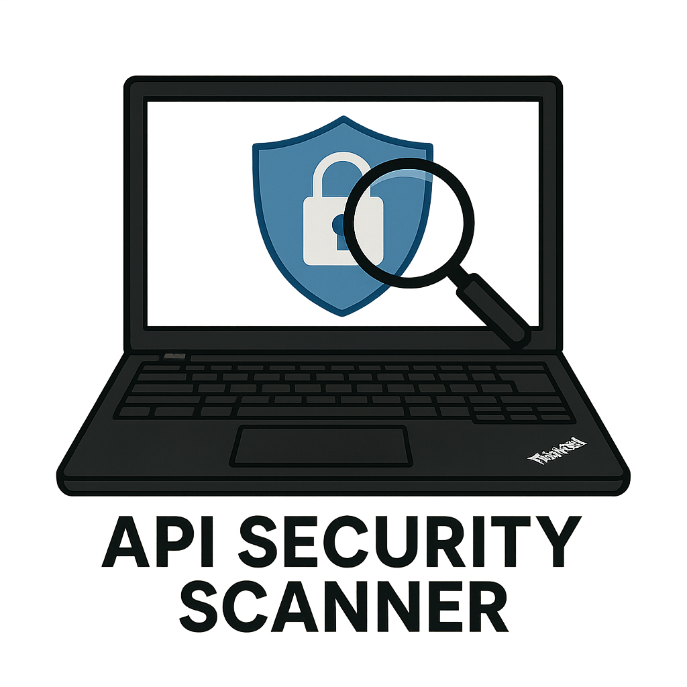

# API Security Scanner

  

  
  
  
  

## Overview

API Security Scanner is an advanced vulnerability assessment tool designed to identify and report security flaws in RESTful and HTTPS APIs. It supports OpenAPI analysis, JWT token auditing, CVSS 4.0 risk scoring, and full OWASP API Top 10 (2023) coverage.

## Features

### API Discovery & Reconnaissance

- Finds OpenAPI/Swagger, GraphQL, and `.well-known` endpoints.

- Detects exposed configs (`.env`, `config.json`, etc.).

### Comprehensive Vulnerability Scanning
- Covers SQLi, XSS, SSRF, command injection, missing authentication, weak rate limiting, and more.  

- Analyzes JWT tokens for weak/none algorithms, missing expiration, and sensitive data exposure.

### CVSS 4.0 Scoring

- Calculates base, temporal, and environmental scores.

### Technology Fingerprinting

- Detects frameworks, languages, and servers from headers and responses.

### Flexible Reporting

- Console-friendly output with rich tables & colors.

- Supports JSON and Markdown export.

## Installation

git clone https://github.com/macbuildssys/api-sec-scanner.git

cd api-sec-scanner

pip install -r requirements.txt

pip install .

Dependencies: PyJWT, PyYAML, click, aiohttp, requests, rich, pydantic

# Usage

Run the scanner via the installed console command: 

api-sec-scanner or api-sec-scanner <https://target-api.com>

# Options

Option	Description

--output, -o	Output file for report

--format, -f	Report format: json

--verbose, -v	Enable verbose output

Example:

C
api-sec-scanner https://api.example.com -f json -o report.json

Example Output

OPERATION	  RISK LEVEL	CVSS 4.0 SCORE	OWASP	VULNERABILITY

GET /users	HIGH	      8.7           	API1:2023	Broken Object Level Authorization

# Roadmap

Add multi-threaded scanning

Add GraphQL schema introspection

Generate HTML reports

Integrate CI/CD pipeline security mode

# Contributing

Contributions are welcome! Please:

Fork the repository

Create a feature branch

Submit a pull request

# License

Distributed under the MIT License. See LICENSE for details.